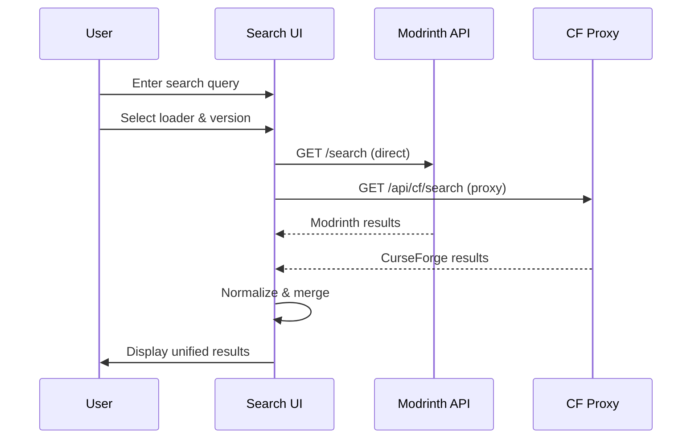

# Feature: Mod Search

## Purpose

Allow users to search for Minecraft mods across both Modrinth and CurseForge platforms simultaneously, with filtering by mod loader and Minecraft version.

## Business Rules

1. Search MUST query both Modrinth and CurseForge APIs
2. Results MUST be filterable by mod loader (Fabric, Forge, NeoForge, Quilt)
3. Results MUST be filterable by Minecraft version
4. Incompatible mods MUST be hidden or flagged
5. Search MUST respond within 200ms perceived latency
6. CurseForge requests MUST go through server proxy (CORS)
7. Modrinth requests MAY go directly (supports CORS)

## Main Flow

## Components

- `src/components/ModSearch.tsx` - Search input and filters
- `src/components/ModCard.tsx` - Individual mod display
- `src/lib/api/modrinth.ts` - Modrinth API client
- `src/lib/api/curseforge.ts` - CurseForge API client
- `netlify/functions/cf.ts` - CurseForge proxy function

## Test Flows

| ID | Scenario | Type | Expected Result |
|----|----------|------|-----------------|
| MS-001 | Search with valid query | Integration | Returns mods from both sources |
| MS-002 | Search with empty query | Unit | Shows popular/featured mods |
| MS-003 | Filter by Fabric loader | Integration | Only Fabric mods returned |
| MS-004 | Filter by version 1.20.1 | Integration | Only 1.20.1 compatible mods |
| MS-005 | CurseForge API timeout | Unit | Graceful degradation, Modrinth only |
| MS-006 | Invalid loader selected | Unit | Error message displayed |

## Definition of Done

- [ ] Search input with debounce (300ms)
- [ ] Loader selector with 4 options
- [ ] Version picker with recent versions
- [ ] Results display with mod cards
- [ ] Loading and error states
- [ ] Keyboard accessible (Tab, Enter)
- [ ] Screen reader compatible (ARIA labels)
- [ ] Works in light and dark mode
- [ ] Unit tests for API clients
- [ ] Integration test for search flow
