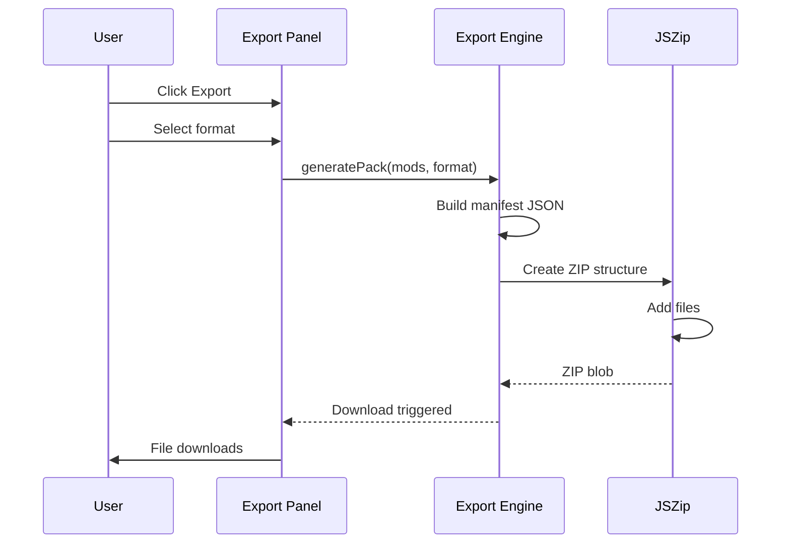

# Feature: Modpack Export

## Purpose

Generate downloadable modpack files in multiple formats (MRPACK, CurseForge ZIP, Packwiz) entirely client-side using JSZip.

## Business Rules

1. Export MUST happen client-side (no server processing)
2. MRPACK format MUST follow Modrinth specification
3. CurseForge format MUST include manifest.json
4. All hashes (SHA512, SHA1) MUST be accurate
5. Export MUST handle 300+ mods without crashing
6. Progress indicator MUST show during export
7. Hybrid exports MUST include Modrinth JARs in overrides/

## Main Flow



## Components

- `src/components/ExportPanel.tsx` - Format selection UI
- `src/lib/export/mrpack.ts` - MRPACK generator
- `src/lib/export/curseforge.ts` - CurseForge generator
- `src/lib/export/packwiz.ts` - Packwiz TOML generator

## Export Formats

### MRPACK (Modrinth)
```
my-modpack.mrpack
├── modrinth.index.json
└── overrides/
    └── config/
```

### CurseForge
```
my-modpack.zip
├── manifest.json
├── modlist.html
└── overrides/
```

### Packwiz
```
packwiz-pack.zip
├── pack.toml
├── index.toml
└── mods/
    └── *.pw.toml
```

## Test Flows

| ID | Scenario | Type | Expected Result |
|----|----------|------|-----------------|
| EX-001 | Export 5 mods as MRPACK | Integration | Valid ZIP with correct manifest |
| EX-002 | Export 100+ mods | Performance | Completes under 5 seconds |
| EX-003 | Export mixed sources | Integration | Hybrid ZIP with overrides |
| EX-004 | Cancel during export | Unit | Cleanup, no partial download |
| EX-005 | Invalid mod data | Unit | Skips invalid, shows warning |

## Definition of Done

- [ ] MRPACK export working
- [ ] CurseForge export working
- [ ] Packwiz export working
- [ ] Progress bar during generation
- [ ] Error handling with user feedback
- [ ] Accessible export buttons
- [ ] Unit tests for each format
- [ ] Integration test for full export
